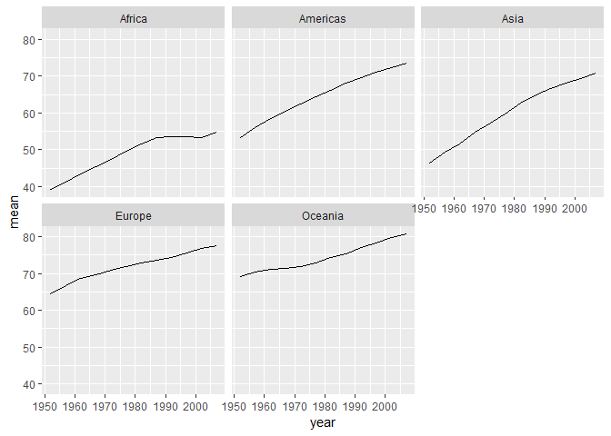

hw05
================

-   [Introduction](#introduction)
-   [Part 1: Factor management](#part-1-factor-management)
-   [Part 2: File I/O](#part-2-file-io)
-   [Part 3: Visualization design](#part-3-visualization-design)
-   [Part 4: Writing figures to file](#part-4-writing-figures-to-file)

Introduction
------------

This is the assignment5 of STAT545, which would mainly focus on the skills of factor, I/O and visual design. The file is well organised by four parts:

-   Factor Management
-   File Import/Export
-   Visualization Design
-   Writing Figures to File

Let's start it with loading the packages.

``` r
suppressPackageStartupMessages(library(tidyverse))
```

    ## Warning: package 'tidyverse' was built under R version 3.5.1

    ## Warning: package 'ggplot2' was built under R version 3.5.1

    ## Warning: package 'tidyr' was built under R version 3.5.1

    ## Warning: package 'readr' was built under R version 3.5.1

    ## Warning: package 'purrr' was built under R version 3.5.1

    ## Warning: package 'dplyr' was built under R version 3.5.1

    ## Warning: package 'forcats' was built under R version 3.5.1

``` r
suppressPackageStartupMessages(library(plotly))
```

    ## Warning: package 'plotly' was built under R version 3.5.1

``` r
suppressPackageStartupMessages(library(gapminder))
```

    ## Warning: package 'gapminder' was built under R version 3.5.1

Part 1: Factor management
-------------------------

-   **Drop factor / levels**

To figure out the function of `droplevels`, Oceania is dropped here.

``` r
before_drop <- gapminder %>% 
  filter(continent != "Oceania") 
```

    ## Warning: package 'bindrcpp' was built under R version 3.5.1

``` r
levels(before_drop$continent)
```

    ## [1] "Africa"   "Americas" "Asia"     "Europe"   "Oceania"

``` r
after_drop <- droplevels(before_drop) 
levels(after_drop$continent)
```

    ## [1] "Africa"   "Americas" "Asia"     "Europe"

From the above, we could see that `droplevels()` function removes unused factor Ocenia in continent.

-   **Reorder levels based on knowledge from data**

In this section, the effects of `arrange()` and `fct_reorder()` are dicusssed in three dimensions: table, levels and figure.

1.  Firstly, let's look into the continent of original dataset.

``` r
knitr::kable(head(gapminder)) # report the first factor in the table
```

| country     | continent |  year|  lifeExp|       pop|  gdpPercap|
|:------------|:----------|-----:|--------:|---------:|----------:|
| Afghanistan | Asia      |  1952|   28.801|   8425333|   779.4453|
| Afghanistan | Asia      |  1957|   30.332|   9240934|   820.8530|
| Afghanistan | Asia      |  1962|   31.997|  10267083|   853.1007|
| Afghanistan | Asia      |  1967|   34.020|  11537966|   836.1971|
| Afghanistan | Asia      |  1972|   36.088|  13079460|   739.9811|
| Afghanistan | Asia      |  1977|   38.438|  14880372|   786.1134|

``` r
levels(gapminder$continent) # report the order of factors
```

    ## [1] "Africa"   "Americas" "Asia"     "Europe"   "Oceania"

``` r
gapminder %>% 
  ggplot(aes(x = continent)) +
  geom_bar() # demonstrate the sequence of levels in the plot
```


1.  Then try to `arrange()` the continent in descending order. See what would happen.

``` r
df <- gapminder %>% 
  arrange(desc(continent))

knitr::kable(head(df))
```

| country   | continent |  year|  lifeExp|       pop|  gdpPercap|
|:----------|:----------|-----:|--------:|---------:|----------:|
| Australia | Oceania   |  1952|    69.12|   8691212|   10039.60|
| Australia | Oceania   |  1957|    70.33|   9712569|   10949.65|
| Australia | Oceania   |  1962|    70.93|  10794968|   12217.23|
| Australia | Oceania   |  1967|    71.10|  11872264|   14526.12|
| Australia | Oceania   |  1972|    71.93|  13177000|   16788.63|
| Australia | Oceania   |  1977|    73.49|  14074100|   18334.20|

``` r
levels(df$continent)
```

    ## [1] "Africa"   "Americas" "Asia"     "Europe"   "Oceania"

``` r
df %>% 
  ggplot(aes(x = continent)) +
  geom_bar()
```


As observed, the first factor listed in the table has changed to Oceania since `arrange()`. However, it doesn't have a effect on the levels and graph.

1.  Move to `fct_reorder` now. Order the continent level by the max of life expectancy.

``` r
df <- gapminder %>% 
  mutate(continent = fct_reorder(continent,.fun=max,lifeExp))

knitr::kable(head(df))
```

| country     | continent |  year|  lifeExp|       pop|  gdpPercap|
|:------------|:----------|-----:|--------:|---------:|----------:|
| Afghanistan | Asia      |  1952|   28.801|   8425333|   779.4453|
| Afghanistan | Asia      |  1957|   30.332|   9240934|   820.8530|
| Afghanistan | Asia      |  1962|   31.997|  10267083|   853.1007|
| Afghanistan | Asia      |  1967|   34.020|  11537966|   836.1971|
| Afghanistan | Asia      |  1972|   36.088|  13079460|   739.9811|
| Afghanistan | Asia      |  1977|   38.438|  14880372|   786.1134|

``` r
levels(df$continent)
```

    ## [1] "Africa"   "Americas" "Oceania"  "Europe"   "Asia"

``` r
df %>% 
  ggplot(aes(x = continent)) +
  geom_bar()
```


`fct_reorder` has no effect on the contents of table. But the order of levels indeed changes. And the sequence in the graph always follows the levels.

1.  Last, use both `fct_order` and `arrange` here.

``` r
df <- gapminder %>% 
  arrange(desc(continent)) %>% 
  mutate(continent = fct_reorder(continent, .fun=max, lifeExp))

knitr::kable(head(df))
```

| country   | continent |  year|  lifeExp|       pop|  gdpPercap|
|:----------|:----------|-----:|--------:|---------:|----------:|
| Australia | Oceania   |  1952|    69.12|   8691212|   10039.60|
| Australia | Oceania   |  1957|    70.33|   9712569|   10949.65|
| Australia | Oceania   |  1962|    70.93|  10794968|   12217.23|
| Australia | Oceania   |  1967|    71.10|  11872264|   14526.12|
| Australia | Oceania   |  1972|    71.93|  13177000|   16788.63|
| Australia | Oceania   |  1977|    73.49|  14074100|   18334.20|

``` r
levels(df$continent)
```

    ## [1] "Africa"   "Americas" "Oceania"  "Europe"   "Asia"

``` r
df %>% 
  ggplot(aes(x = continent)) +
  geom_bar()
```


It can be concluded that the effects of two functions mix together. The table follows `arrange` and the levels follow `fct_reorder`.

Part 2: File I/O
----------------

Out of convenience, use `df`(non-alphabetical) from the previous section to test.

``` r
write_csv(df,"my_df.csv")
read_df <- read_csv("my_df.csv")
```

    ## Parsed with column specification:
    ## cols(
    ##   country = col_character(),
    ##   continent = col_character(),
    ##   year = col_integer(),
    ##   lifeExp = col_double(),
    ##   pop = col_integer(),
    ##   gdpPercap = col_double()
    ## )

``` r
summary(read_df)
```

    ##    country           continent              year         lifeExp     
    ##  Length:1704        Length:1704        Min.   :1952   Min.   :23.60  
    ##  Class :character   Class :character   1st Qu.:1966   1st Qu.:48.20  
    ##  Mode  :character   Mode  :character   Median :1980   Median :60.71  
    ##                                        Mean   :1980   Mean   :59.47  
    ##                                        3rd Qu.:1993   3rd Qu.:70.85  
    ##                                        Max.   :2007   Max.   :82.60  
    ##       pop              gdpPercap       
    ##  Min.   :6.001e+04   Min.   :   241.2  
    ##  1st Qu.:2.794e+06   1st Qu.:  1202.1  
    ##  Median :7.024e+06   Median :  3531.8  
    ##  Mean   :2.960e+07   Mean   :  7215.3  
    ##  3rd Qu.:1.959e+07   3rd Qu.:  9325.5  
    ##  Max.   :1.319e+09   Max.   :113523.1

``` r
head(read_df)
```

    ## # A tibble: 6 x 6
    ##   country   continent  year lifeExp      pop gdpPercap
    ##   <chr>     <chr>     <int>   <dbl>    <int>     <dbl>
    ## 1 Australia Oceania    1952    69.1  8691212    10040.
    ## 2 Australia Oceania    1957    70.3  9712569    10950.
    ## 3 Australia Oceania    1962    70.9 10794968    12217.
    ## 4 Australia Oceania    1967    71.1 11872264    14526.
    ## 5 Australia Oceania    1972    71.9 13177000    16789.
    ## 6 Australia Oceania    1977    73.5 14074100    18334.

``` r
levels(read_df)
```

    ## NULL

The new df from csv file stores the contents of original table, but it lose the factors.

Part 3: Visualization design
----------------------------

This graph shows how the mean of life expectancy changes in five continents.

``` r
p <- gapminder %>% 
  group_by(continent,year) %>% 
  summarise(mean = mean(lifeExp)) %>% 
  ggplot(aes(y = mean,x = year)) +
  facet_wrap(~ continent) +
  geom_line() 
p
```



It's correct but not good. Let's make it more juicy now.

``` r
p_new <- p +
  geom_point(aes(color = continent)) + # colored by continent
  labs(x = "Year",
          y = "Mean of Life Expectancy",
          title = "The mean of life expectancy over time in five continents") + # change the axis-label's names and add the title
  theme_bw() + # apply the theme
  theme(axis.text = element_text(size=7), # adjust the size of axis-text
          strip.background = element_rect(fill= "orange") # fill the background of banner
        )
p_new
```


All the changes are mentioned in the in-line code comments. The new graph is much better to diffentiate the five continents and understand what the values represent.

Next up, convert this graph to a `plotly` one.(Shown in the  file)

``` r
#ggplotly(p_new)
```

Many advantages that plotly has over ggplot2, such as:

-   Interactive with graph.
-   Customizing the layout (plot borders, y axis) is easier.
-   Flexible for Python, Matlab, and Excel, among other languages.
-   Possible for multi-dimensions graph.

Part 4: Writing figures to file
-------------------------------

Save the plot from the previous section to file.

``` r
ggsave("my_plot.png", p_new, width = 10, height = 6, dpi = 300)
```

Then read it out.


